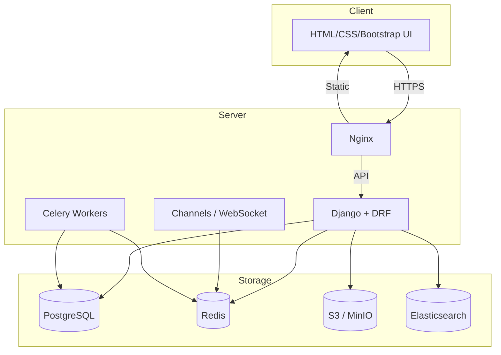

# System Architecture

```mermaid
graph TB
    subgraph Client
        UI[HTML/CSS/Bootstrap UI]
    end

    subgraph Server
        N[Nginx]
        DJ[Django + DRF]
        CH[Channels / WebSocket]
        CL[Celery Workers]
    end

    subgraph Storage
        PG[(PostgreSQL)]
        RD[(Redis)]
        S3[(S3 / MinIO)]
        ES[(Elasticsearch)]
    end

    UI -->|HTTPS| N
    N -->|Static| UI
    N -->|API| DJ
    DJ --> PG
    DJ --> RD
    DJ --> S3
    DJ --> ES
    CH --> RD
    CL --> RD
    CL --> PG
```
