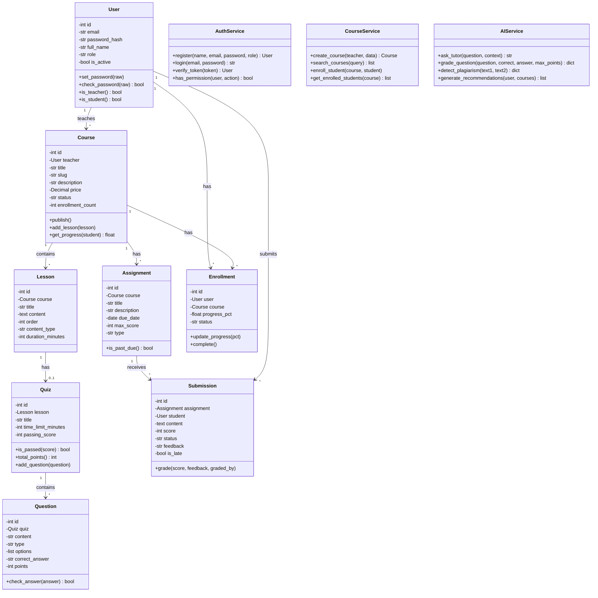

# Python Class Diagram

```mermaid
classDiagram
    class User {
        -int id
        -str email
        -str password_hash
        -str full_name
        -str role
        -bool is_active
        +set_password(raw)
        +check_password(raw) bool
        +is_teacher() bool
        +is_student() bool
    }

    class Course {
        -int id
        -User teacher
        -str title
        -str slug
        -str description
        -Decimal price
        -str status
        -int enrollment_count
        +publish()
        +add_lesson(lesson)
        +get_progress(student) float
    }

    class Lesson {
        -int id
        -Course course
        -str title
        -text content
        -int order
        -str content_type
        -int duration_minutes
    }

    class Quiz {
        -int id
        -Lesson lesson
        -str title
        -int time_limit_minutes
        -int passing_score
        +is_passed(score) bool
        +total_points() int
        +add_question(question)
    }

    class Question {
        -int id
        -Quiz quiz
        -str content
        -str type
        -list options
        -str correct_answer
        -int points
        +check_answer(answer) bool
    }

    class Assignment {
        -int id
        -Course course
        -str title
        -str description
        -date due_date
        -int max_score
        -str type
        +is_past_due() bool
    }

    class Submission {
        -int id
        -Assignment assignment
        -User student
        -text content
        -int score
        -str status
        -str feedback
        -bool is_late
        +grade(score, feedback, graded_by)
    }

    class Enrollment {
        -int id
        -User user
        -Course course
        -float progress_pct
        -str status
        +update_progress(pct)
        +complete()
    }

    class AuthService {
        +register(name, email, password, role) User
        +login(email, password) str
        +verify_token(token) User
        +has_permission(user, action) bool
    }

    class CourseService {
        +create_course(teacher, data) Course
        +search_courses(query) list
        +enroll_student(course, student)
        +get_enrolled_students(course) list
    }

    class AIService {
        +ask_tutor(question, context) str
        +grade_question(question, correct, answer, max_points) dict
        +detect_plagiarism(text1, text2) dict
        +generate_recommendations(user, courses) list
    }

    Course "1" --> "*" Lesson : contains
    Lesson "1" --> "0..1" Quiz : has
    Quiz "1" --> "*" Question : contains
    Course "1" --> "*" Assignment : has
    Assignment "1" --> "*" Submission : receives
    User "1" --> "*" Enrollment : has
    Course "1" --> "*" Enrollment : has
    User "1" --> "*" Course : teaches
    User "1" --> "*" Submission : submits
```
