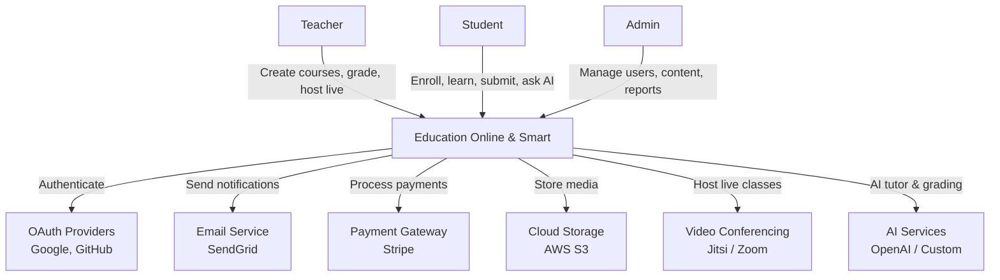

# Context Diagram

```mermaid
graph TD
    SYSTEM[Education Online & Smart]

    TEACHER[Teacher]
    STUDENT[Student]
    ADMIN[Admin]

    OAUTH[OAuth Providers<br/>Google, GitHub]
    EMAIL[Email Service<br/>SendGrid]
    PAYMENT[Payment Gateway<br/>Stripe]
    STORAGE[Cloud Storage<br/>AWS S3]
    VIDEO[Video Conferencing<br/>Jitsi / Zoom]
    AI[AI Services<br/>OpenAI / Custom]

    TEACHER -->|Create courses, grade, host live| SYSTEM
    STUDENT -->|Enroll, learn, submit, ask AI| SYSTEM
    ADMIN -->|Manage users, content, reports| SYSTEM

    SYSTEM -->|Authenticate| OAUTH
    SYSTEM -->|Send notifications| EMAIL
    SYSTEM -->|Process payments| PAYMENT
    SYSTEM -->|Store media| STORAGE
    SYSTEM -->|Host live classes| VIDEO
    SYSTEM -->|AI tutor & grading| AI
```
