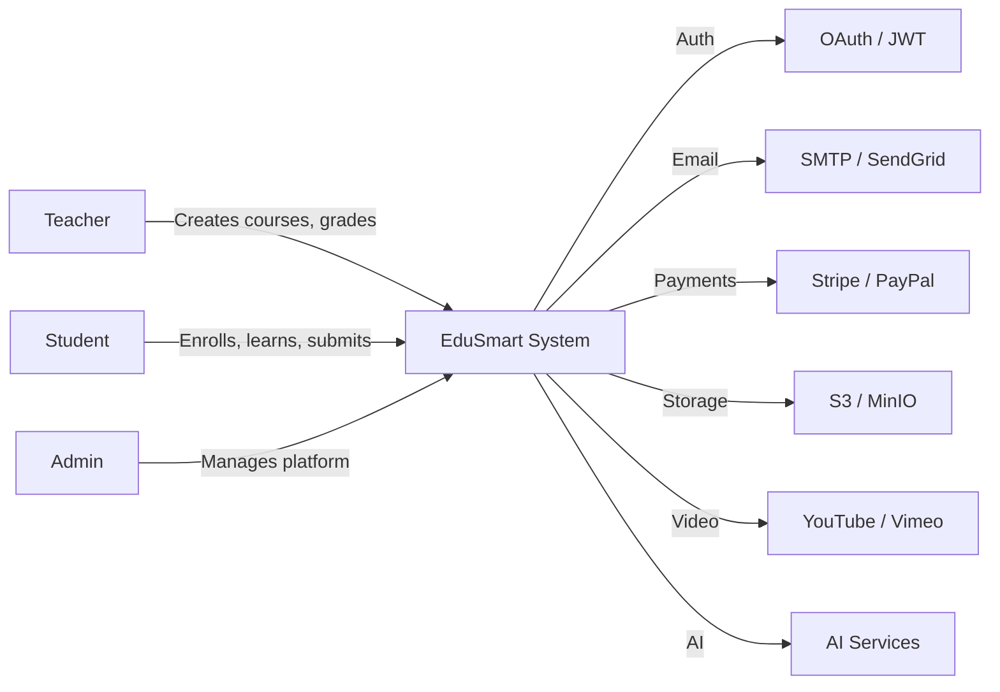

# System Context

```mermaid
graph LR
    T[Teacher] -->|Creates courses, grades| S[EduSmart System]
    St[Student] -->|Enrolls, learns, submits| S
    A[Admin] -->|Manages platform| S
    S -->|Auth| O[OAuth / JWT]
    S -->|Email| EM[SMTP / SendGrid]
    S -->|Payments| P[Stripe / PayPal]
    S -->|Storage| ST[S3 / MinIO]
    S -->|Video| V[YouTube / Vimeo]
    S -->|AI| AI[AI Services]
```
