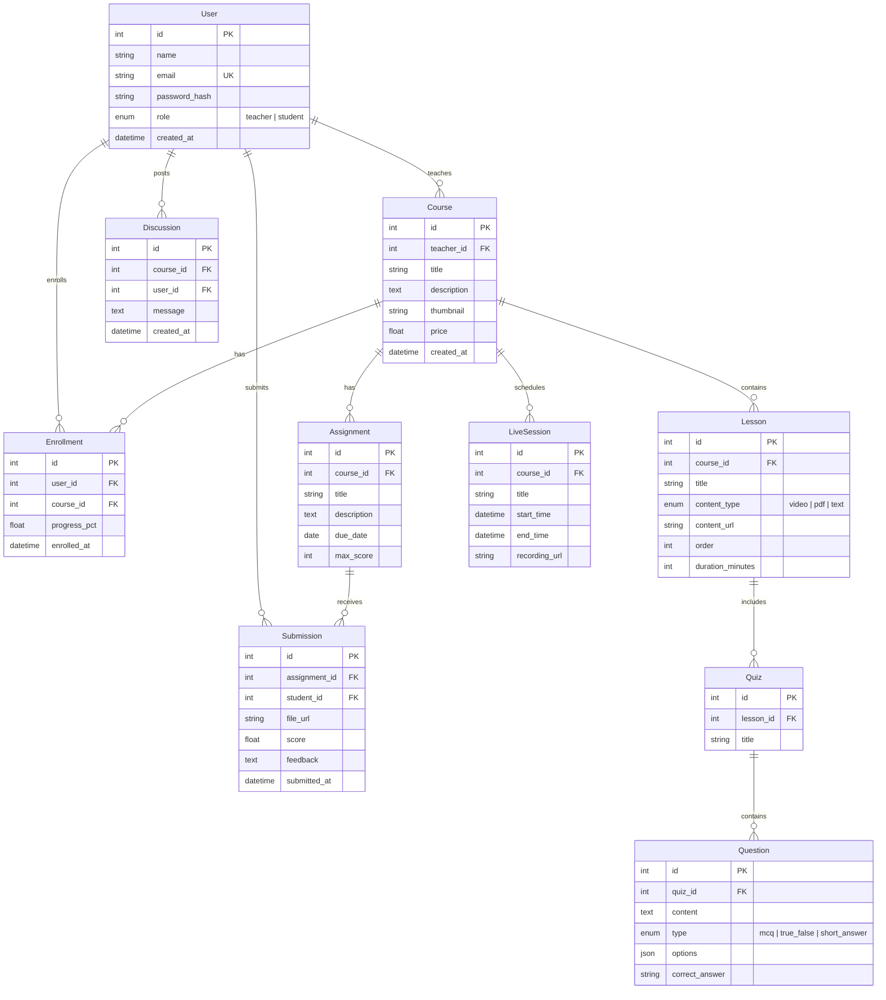

# Entity Relationship Diagram

```mermaid
erDiagram
    User ||--o{ Course : "teaches"
    User ||--o{ Enrollment : "enrolls"
    User ||--o{ Submission : "submits"
    User ||--o{ Discussion : "posts"
    Course ||--o{ Lesson : "contains"
    Course ||--o{ Assignment : "has"
    Course ||--o{ Enrollment : "has"
    Course ||--o{ LiveSession : "schedules"
    Lesson ||--o{ Quiz : "includes"
    Quiz ||--o{ Question : "contains"
    Assignment ||--o{ Submission : "receives"

    User {
        int id PK
        string name
        string email UK
        string password_hash
        enum role "teacher | student"
        datetime created_at
    }

    Course {
        int id PK
        int teacher_id FK
        string title
        text description
        string thumbnail
        float price
        datetime created_at
    }

    Lesson {
        int id PK
        int course_id FK
        string title
        enum content_type "video | pdf | text"
        string content_url
        int order
        int duration_minutes
    }

    Assignment {
        int id PK
        int course_id FK
        string title
        text description
        date due_date
        int max_score
    }

    Submission {
        int id PK
        int assignment_id FK
        int student_id FK
        string file_url
        float score
        text feedback
        datetime submitted_at
    }

    Quiz {
        int id PK
        int lesson_id FK
        string title
    }

    Question {
        int id PK
        int quiz_id FK
        text content
        enum type "mcq | true_false | short_answer"
        json options
        string correct_answer
    }

    Enrollment {
        int id PK
        int user_id FK
        int course_id FK
        float progress_pct
        datetime enrolled_at
    }

    LiveSession {
        int id PK
        int course_id FK
        string title
        datetime start_time
        datetime end_time
        string recording_url
    }

    Discussion {
        int id PK
        int course_id FK
        int user_id FK
        text message
        datetime created_at
    }
```
