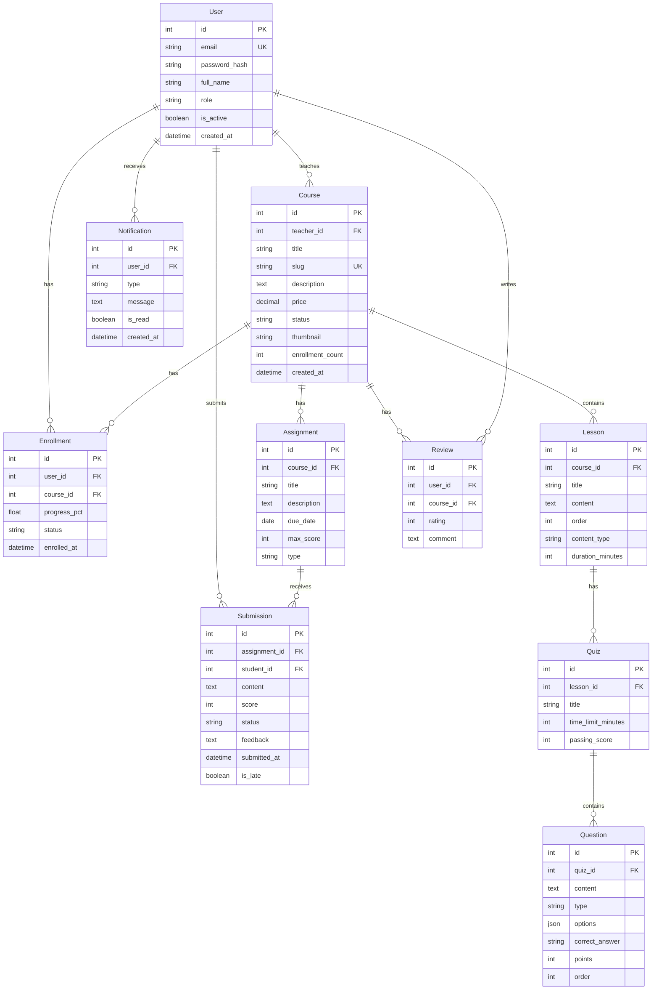

# Database Schema (ERD)

```mermaid
erDiagram
    User ||--o{ Course : teaches
    User ||--o{ Enrollment : has
    User ||--o{ Submission : submits
    Course ||--o{ Lesson : contains
    Course ||--o{ Enrollment : has
    Course ||--o{ Assignment : has
    Lesson ||--o{ Quiz : has
    Quiz ||--o{ Question : contains
    Assignment ||--o{ Submission : receives
    User ||--o{ Notification : receives
    Course ||--o{ Review : has
    User ||--o{ Review : writes

    User {
        int id PK
        string email UK
        string password_hash
        string full_name
        string role
        boolean is_active
        datetime created_at
    }

    Course {
        int id PK
        int teacher_id FK
        string title
        string slug UK
        text description
        decimal price
        string status
        string thumbnail
        int enrollment_count
        datetime created_at
    }

    Lesson {
        int id PK
        int course_id FK
        string title
        text content
        int order
        string content_type
        int duration_minutes
    }

    Quiz {
        int id PK
        int lesson_id FK
        string title
        int time_limit_minutes
        int passing_score
    }

    Question {
        int id PK
        int quiz_id FK
        text content
        string type
        json options
        string correct_answer
        int points
        int order
    }

    Assignment {
        int id PK
        int course_id FK
        string title
        text description
        date due_date
        int max_score
        string type
    }

    Submission {
        int id PK
        int assignment_id FK
        int student_id FK
        text content
        int score
        string status
        text feedback
        datetime submitted_at
        boolean is_late
    }

    Enrollment {
        int id PK
        int user_id FK
        int course_id FK
        float progress_pct
        string status
        datetime enrolled_at
    }

    Notification {
        int id PK
        int user_id FK
        string type
        text message
        boolean is_read
        datetime created_at
    }

    Review {
        int id PK
        int user_id FK
        int course_id FK
        int rating
        text comment
    }
```
