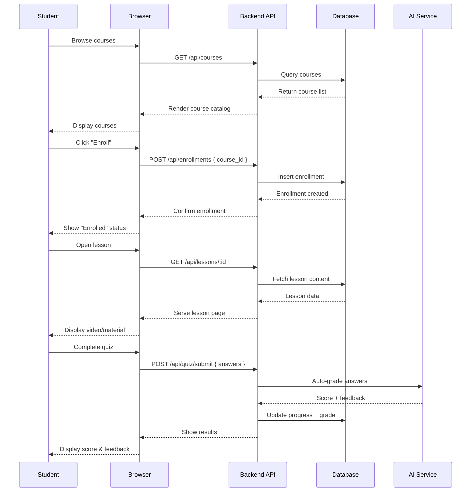

# Sequence Diagram

```mermaid
sequenceDiagram
    participant Student
    participant Browser
    participant API as Backend API
    participant DB as Database
    participant AI as AI Service

    Student->>Browser: Browse courses
    Browser->>API: GET /api/courses
    API->>DB: Query courses
    DB-->>API: Return course list
    API-->>Browser: Render course catalog
    Browser-->>Student: Display courses

    Student->>Browser: Click "Enroll"
    Browser->>API: POST /api/enrollments { course_id }
    API->>DB: Insert enrollment
    DB-->>API: Enrollment created
    API-->>Browser: Confirm enrollment
    Browser-->>Student: Show "Enrolled" status

    Student->>Browser: Open lesson
    Browser->>API: GET /api/lessons/:id
    API->>DB: Fetch lesson content
    DB-->>API: Lesson data
    API-->>Browser: Serve lesson page
    Browser-->>Student: Display video/material

    Student->>Browser: Complete quiz
    Browser->>API: POST /api/quiz/submit { answers }
    API->>AI: Auto-grade answers
    AI-->>API: Score + feedback
    API->>DB: Update progress + grade
    API-->>Browser: Show results
    Browser-->>Student: Display score & feedback
```
